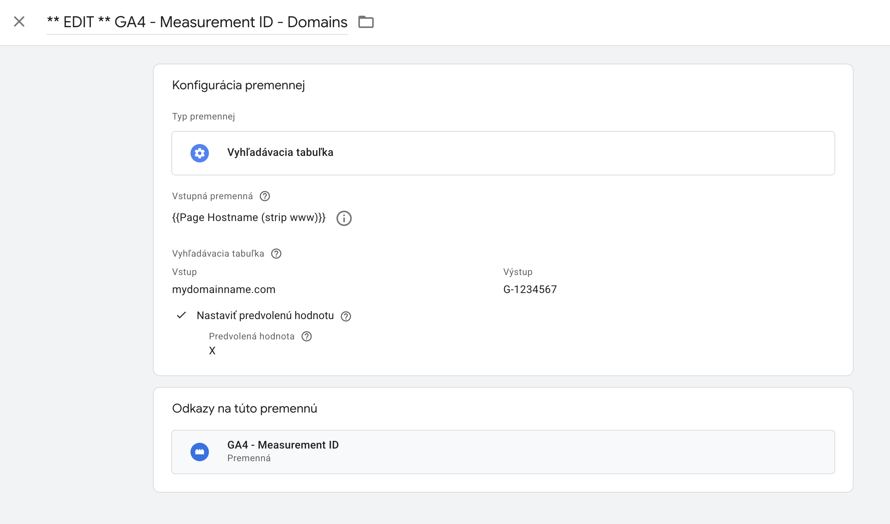
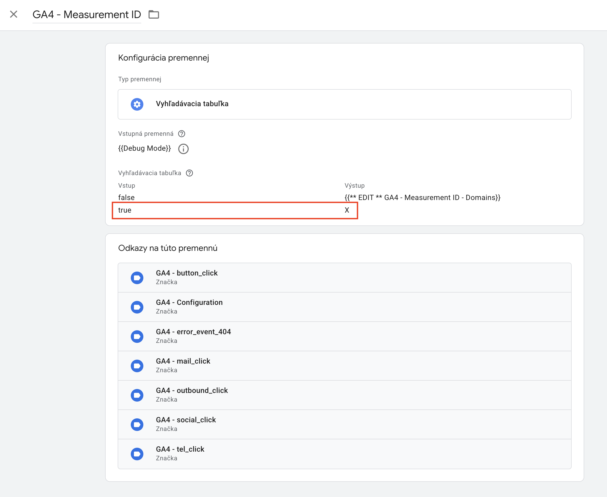

# DASE – GA4 – Basic | Template

---

## Obsah
- [Prehľad](#prehľad)
- [Import do Google Tag Managera](#import-do-google-tag-managera)
- [Nastavenie a použitie](#nastavenie-a-použitie)
- [Debug mód](#debug-mód)
- [Changelog](#changelog)
- [Kontakt a odkazy](#kontakt-a-odkazy)

---

## Prehľad  
Táto šablóna slúži na základné meranie interakcií na webovej stránke.  

Obsahuje:  
- konfiguračný tag na odosielanie page view udalostí  
- udalosti rozšíreného merania v Google Analytics (formuláre, videá, súbory)  
- sledovanie kliknutí na tlačidlá, emaily, telefónne čísla, odkazy na sociálne siete a odchádzajúce linky  
- detekciu zobrazenia 404 stránok  

 

 

---

## Import do Google Tag Managera  
1. V kontajneri prejdite do sekcie **Správca**.  
2. Kliknite na **Importovať kontajner**.  
3. Vyberte súbor stiahnutý z GitHub repozitára.  
4. Odporúčame vytvoriť si nový pracovný priestor:  
   - kliknite na **Vybrať pracovný priestor**  
   - vpravo hore kliknite na **+**  
5. V sekcii **Vyberte možnosť importu** zvoľte požadovanú voľbu.  
   - ak chcete prepísať existujúci obsah, vyberte **Prepísať**  

---

## Nastavenie a použitie  
1. V premennej **`GA4 - Measurement ID - Domains`** doplňte:  
   - URL adresu vašej webovej stránky  
   - Measurement ID z Google Analytics  
   > Šablóna je pripravená na multidomain meranie a používa Lookup Table.  
2. Po úprave odstráňte z názvu premennej prefix **`EDIT`**.  

 

 

---

## Debug mód  
- Vo východiskovom nastavení sa hity z debug módu neposielajú do GA4.  
- Ak chcete odosielať hity aj v debug móde alebo použiť testovaciu property:  
  - v premennej **`GA4 - Measurement ID`** nahraďte hodnotu **`X`** požadovaným Measurement ID.  

 

 

---

## Changelog  
- **1.0.0** – Prvé vydanie šablóny

---

## Kontakt a odkazy  
Máte nejaké otázky alebo nejasnosti? Napíšte nám na **cibula@dase.sk**  

👉 [Dase Blog](https://www.dase-analytics.com/blog/sk/)  
👉 [Dase Instagram](https://www.instagram.com/daseanalytics/)
