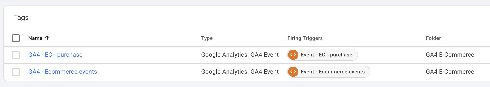
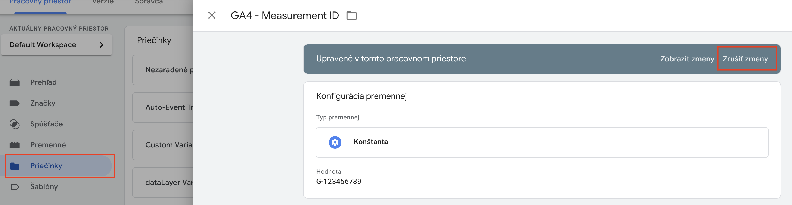

# DASE – GA4 – E-commerce | Template

## Obsah
- [Prehľad](#prehľad)
- [Import do Google Tag Managera](#import-do-google-tag-managera)
- [Nastavenie a použitie](#nastavenie-a-použitie)
- [Changelog](#changelog)
- [Kontakt a odkazy](#kontakt-a-odkazy)

## Prehľad  
Táto šablóna slúži na základné meranie e-commerce udalostí na webovej stránke.  
Vychádza z **Google Analytics Ecommerce Measurements** a predpokladá implementáciu štandardného e-commerce `dataLayer` podľa Google špecifikácie.  

Obsahuje:  
- meranie všetkých základných e-commerce udalostí v jednom tage:  
  `view_item_list`, `select_item`, `view_item`, `add_to_cart`, `remove_from_cart`, `view_cart`, `begin_checkout`, `add_shipping_info`, `add_payment_info`  
- samostatný **Purchase** tag  

 

 

## Import do Google Tag Managera  
1. V kontajneri prejdite do sekcie **Správca**.  
2. Kliknite na **Importovať kontajner**.  
3. Vyberte súbor stiahnutý z GitHub repozitára.  
4. Odporúčame vytvoriť si nový pracovný priestor:  
   - kliknite na **Vybrať pracovný priestor**  
   - vpravo hore kliknite na **+**  
5. V sekcii **Vyberte možnosť importu**:  
   - ak používate našu **DASE – GA4 – Basic** šablónu, vyberte možnosť **Zlúčiť** a následne **Prepísať vzájomne nezlúčiteľné štítky, spúšťače a premenné**  
   - potom otvorte priečinok **PLACEHOLDERS**, otvorte každý tag a kliknite na **Zrušiť zmeny** – tým vrátite prepísané položky z Basic šablóny do pôvodného stavu vo vašom kontajneri  

 

 

## Nastavenie a použitie  
- Nie je potrebné žiadne ďalšie nastavenie.  
- Správne fungovanie vyžaduje implementáciu štandardného `dataLayer` podľa Google špecifikácie.

## Changelog  
- **1.0.0** – Prvé vydanie šablóny

## Kontakt a odkazy  
Máte nejaké otázky alebo nejasnosti? Napíšte nám na **cibula@dase.sk**  

👉 [Dase Blog](https://www.dase-analytics.com/blog/sk/)  
👉 [Dase Instagram](https://www.instagram.com/daseanalytics/)
