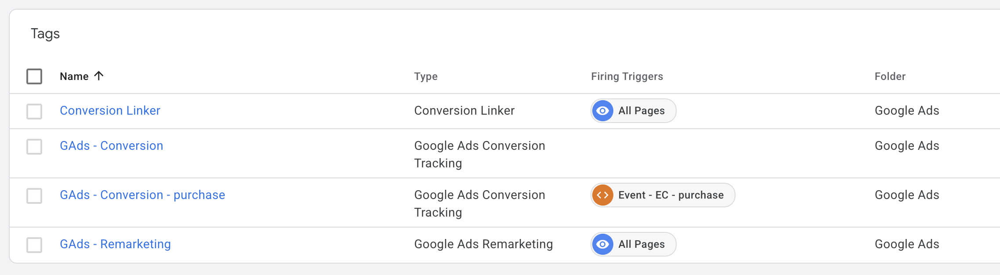
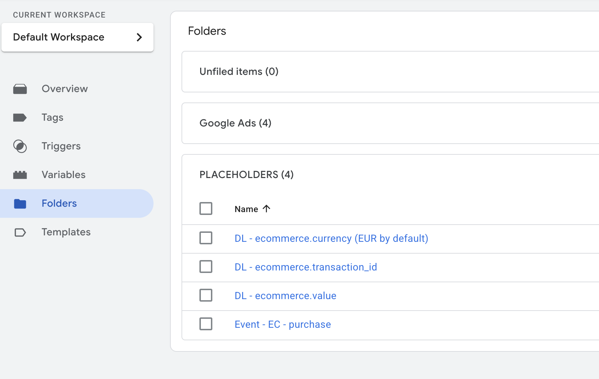
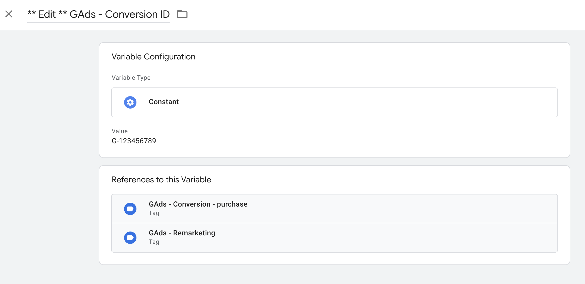
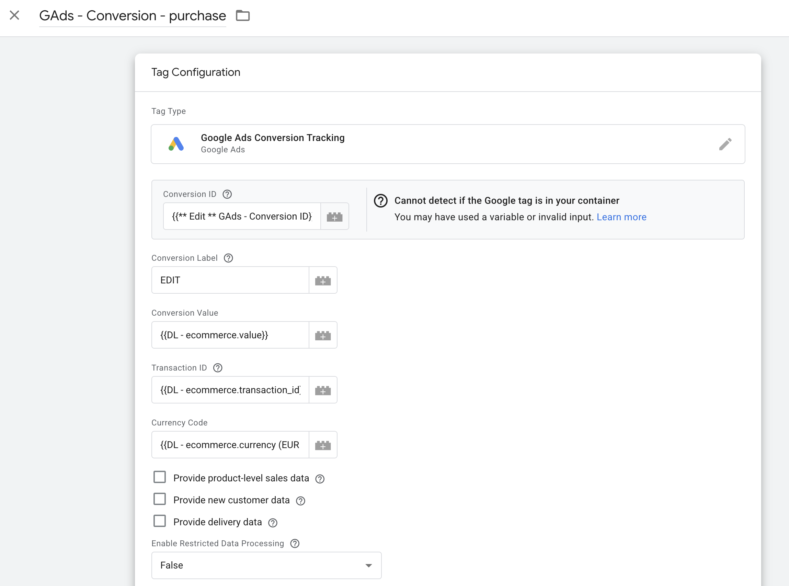

# DASE – Google Ads | Template

## Obsah
- [Prehľad](#prehľad)
- [Import do Google Tag Managera](#import-do-google-tag-managera)
- [Nastavenie a použitie](#nastavenie-a-použitie)
- [Changelog](#changelog)
- [Kontakt a odkazy](#kontakt-a-odkazy)

## Prehľad  
Táto šablóna slúži na základné meranie marketingových udalostí pre **Google Ads**.  
Vychádza z **Google Analytics Ecommerce Measurements** a predpokladá implementáciu štandardného e-commerce `dataLayer` podľa Google špecifikácie.  

Obsahuje:  
- remarketingový tag  
- konverzný **Purchase** tag  

 

 

## Import do Google Tag Managera  
1. V kontajneri prejdite do sekcie **Správca**.  
2. Kliknite na **Importovať kontajner**.  
3. Vyberte súbor stiahnutý z GitHub repozitára.  
4. Odporúčame vytvoriť si nový pracovný priestor:  
   - kliknite na **Vybrať pracovný priestor**  
   - vpravo hore kliknite na **+**  
5. V sekcii **Vyberte možnosť importu**:  
   - ak používate našu **DASE – GA4 – E-commerce** šablónu, vyberte možnosť **Zlúčiť** a následne **Prepísať vzájomne nezlúčiteľné štítky, spúšťače a premenné**  
   - potom otvorte priečinok **PLACEHOLDERS**, otvorte každý tag v priečinku a kliknite na **Zrušiť zmeny** – tým vrátite prepísané položky z E-commerce šablóny do pôvodného stavu vo vašom kontajneri  

 

 

## Nastavenie a použitie  
- V premennej **`GAds - Conversion ID`** nahraďte hodnotu **`G-123456789`** vašim Google Ads Conversion ID.  
- Do **Purchase** tagu vložte konverzný štítok (*conversion label*) konverzie, ktorú ste vytvorili v Google Ads.  

 

 

 

## Changelog  
- **1.0.0** – Prvé vydanie šablóny

## Kontakt a odkazy  
Máte nejaké otázky alebo nejasnosti? Napíšte nám na **cibula@dase.sk**  

👉 [Dase Blog](https://www.dase-analytics.com/blog/sk/)  
👉 [Dase Instagram](https://www.instagram.com/daseanalytics/)
