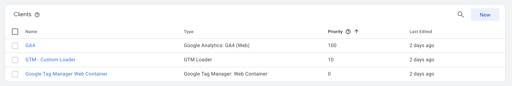
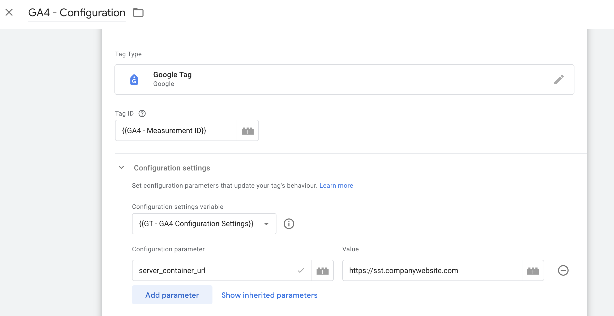
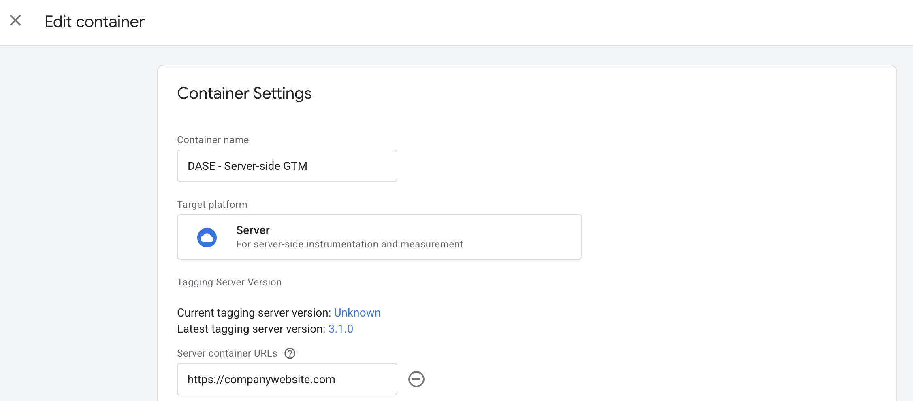

# DASE – Server-Side GTM | Template

## Obsah
- [Prehľad](#prehľad)
- [Import do Google Tag Managera](#import-do-google-tag-managera)
- [Nastavenie a použitie](#nastavenie-a-použitie)
- [Changelog](#changelog)
- [Kontakt a odkazy](#kontakt-a-odkazy)

## Prehľad  
Táto šablóna slúži na základné nastavenie **serverového GTM kontajnera**.  
Predpokladá:  
- správne nastavené merania v klientskom kontajneri  
- mapovanie servera na vlastnú (sub)doménu  

Obsahuje:  
- **GA4 klient** – spracováva Google Analytics requesty  
- **GTM web container klient** – umožňuje načítanie Google skriptov (napr. `gtm.js`, `gtag.js`) zo serveru  
- **GTM custom loader klient** – umožňuje nastaviť vlastnú cestu na načítanie GTM knižnice  
- **GA4 tag**  

 

 

## Import do Google Tag Managera  
1. V kontajneri prejdite do sekcie **Správca**.  
2. Kliknite na **Importovať kontajner**.  
3. Vyberte súbor stiahnutý z GitHub repozitára.  
4. Odporúčame vytvoriť si nový pracovný priestor:  
   - kliknite na **Vybrať pracovný priestor**  
   - vpravo hore kliknite na **+**  
5. V sekcii **Vyberte možnosť importu** zvoľte požadovanú voľbu.  
   - ak chcete prepísať existujúci obsah, vyberte **Prepísať**  

## Nastavenie a použitie  
0. V konfiguračnom tagu v **klientskom kontajneri** vložte parameter `server_container_url` s hodnotou adresy vášho GTM servera.  

 

 

1. V premennej **`GA4 - Measurement ID`** nahraďte hodnotu `G-XXXXXXXX` vašim Measurement ID.  
2. V premennej **`GTM - web container id`** nahraďte hodnotu `GTM-XXXXXX` ID vášho klientského kontajnera.  
3. *(Voliteľné)* – ak chcete nastaviť vlastnú cestu ku GTM knižnici, v premennej **`GTM - request path`** nahraďte hodnotu `/<custom-path>.js`.  
4. V sekcii **Správca → Nastavenia kontajnera** pridajte URL serverového kontajnera.  

 

 

## Changelog  
- **1.0.0** – Prvé vydanie šablóny

## Kontakt a odkazy  
Máte nejaké otázky alebo nejasnosti? Napíšte nám na **cibula@dase.sk**  

👉 [Dase Blog](https://www.dase-analytics.com/blog/sk/)  
👉 [Dase Instagram](https://www.instagram.com/daseanalytics/)
