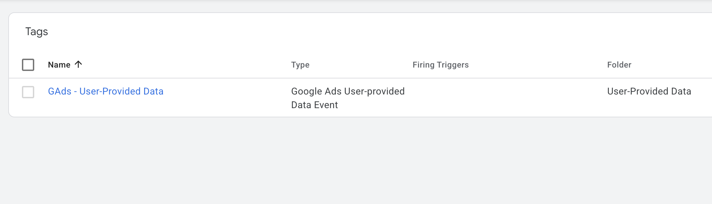
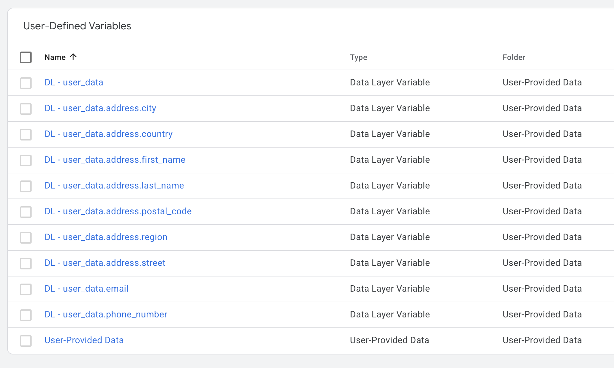
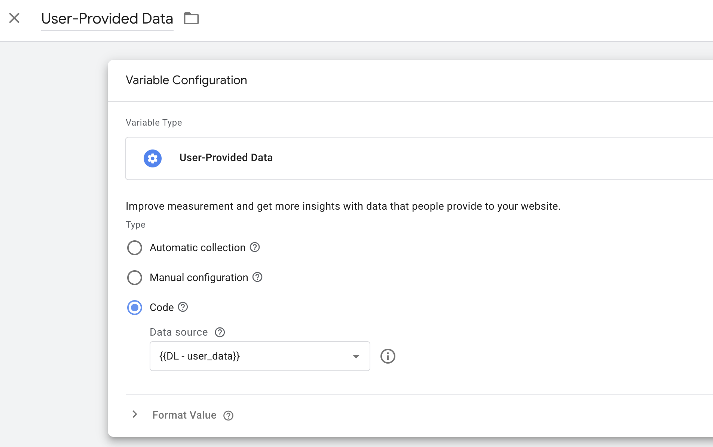
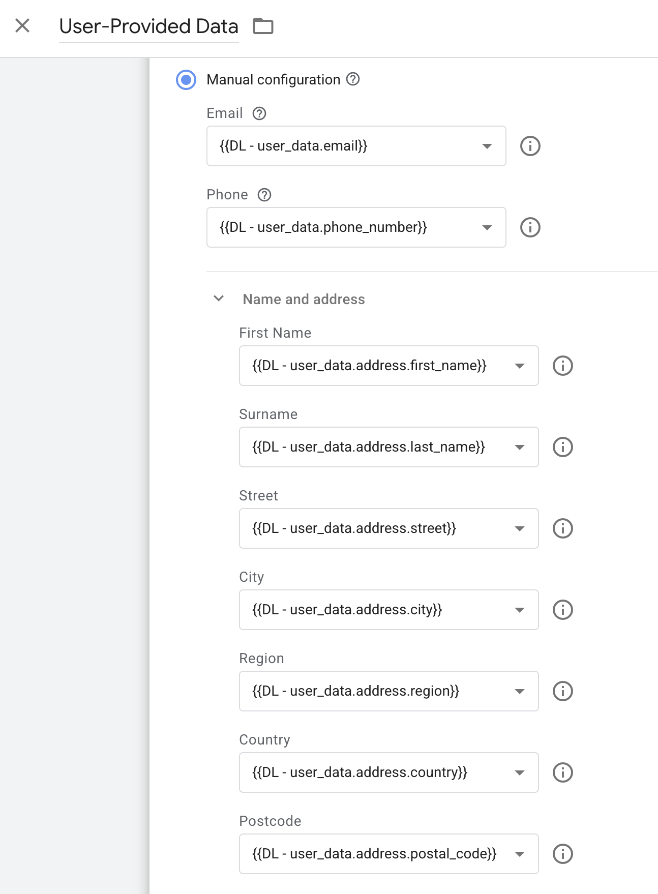

# DASE – User-Provided Data | Template

[](./dase_user_provided_data_template.json)
[](https://support.google.com/tagmanager)
[]()

---

## Obsah
- [Prehľad](#prehľad)
- [Import do Google Tag Managera](#import-do-google-tag-managera)
- [Nastavenie a použitie](#nastavenie-a-použitie)
- [Changelog](#changelog)
- [Kontakt a odkazy](#kontakt-a-odkazy)

---

## Prehľad  
User-Provided Data slúžia na odosielanie rozšírených konverzií (Enhanced Conversions) do Google Ads. Ide o spôsob, ktorý umožňuje presnejšie priraďovanie konverzií na základe užívateľských identifikátorov, ako sú email, telefónne číslo alebo adresa.

Neodporúčame používať automatický mód, keďže neposkytuje plnú kontrolu nad kvalitou dát a často nedokáže spoľahlivo extrahovať všetky potrebné hodnoty. Stabilnejším a presnejším riešením je manuálna implementácia, pri ktorej budete potrebovať asistenciu webového developera.

V šablóne nájdete:
- tag pre odoslanie User-Provided Data do Google Ads
- premenné potrebné pre spracovanie údajov

<br>

<br>

<br>

<br>

---

## Import do Google Tag Managera  
1. V kontajneri prejdite do sekcie **Správca**.  
2. Kliknite na **Importovať kontajner**.  
3. Vyberte súbor stiahnutý z GitHub repozitára.  
4. Odporúčame vytvoriť si nový pracovný priestor:  
   - kliknite na **Vybrať pracovný priestor**  
   - vpravo hore kliknite na **+**  
5. V sekcii **Vyberte možnosť importu** zvoľte požadovanú voľbu.  

---

## Nastavenie a použitie  

Základom pre odosielanie rozšírených konverzií je objekt `user_data`, ktorý musí byť vložený do `dataLayer`u vždy v momente, keď chcete odoslať identifikátory používateľa do Google Ads. Tento objekt musí obsahovať minimálne jeden z podporovaných identifikátorov – najčastejšie email alebo telefónne číslo.

Ukážková štruktúra:

```js
user_data: {
  email: "john.doe@gmail.com",
  phone_number: "+421903123456",
  address: {
    first_name: "John",
    last_name: "Doe",
    street: "Hrdinov 1",
    city: "Bratislava",
    region: "Bratislava",
    postal_code: "81108",
    country: "SK"
  }
}
```


### 1. Code mode (používaný v Dase)

V tomto režime musí mať objekt user_data presnú štruktúru definovanú v oficiálnej dokumentácii. Celý objekt sa odovzdáva priamo cez dataLayer.push() a v GTM sa načíta ako jedna dátová premenná, ktorá sa následne použije v User-Provided Data premennej.

<br>

<br> 

---

### 2. Manual mode

Umožňuje manuálne mapovať jednotlivé parametre v User-Provided Data premennej. Tento prístup je vhodný v prípadoch, keď objekt user_data nemá štruktúru podľa Google dokumentácie alebo keď chcete selektívne obmedziť odosielanie niektorých údajov, hoci sú v objekte k dispozícii. 

<br>

<br>

---

## Changelog  
- **1.0.0** – Prvé vydanie šablóny

---

## Kontakt a odkazy  
Máte nejaké otázky alebo nejasnosti? Napíšte nám na **cibula@dase.sk**  

👉 [Dase Blog](https://www.dase-analytics.com/blog/sk/)  
👉 [Dase Instagram](https://www.instagram.com/daseanalytics/)