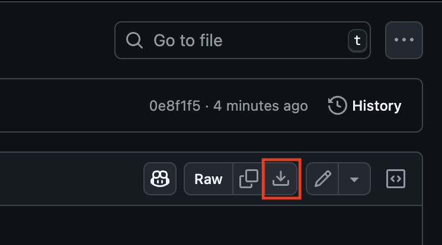

# 📦 DASE – Google Tag Manager Templates

 
 

Repozitár obsahuje predpripravené šablóny (templates) pre Google Tag Manager, ktoré môžete voľne použiť vo svojich projektoch. Každá šablóna má vlastné README s podrobným popisom, návodom na import a nastavenie.

Naše šablóny sú dostupné pod licenciou MIT. Snažili sme sa ich pripraviť univerzálne, no každá webová stránka je trochu iná. Preto je možné, že si budú vyžadovať drobné úpravy, aby fungovali presne tak, ako potrebujete. Pred nasadením ich preto odporúčame najskôr otestovať v testovacom prostredí.

Ak si nebudete vedieť rady alebo budete mať otázky, radi vám pomôžeme – stačí nám napísať na cibula@dase.sk.

## 📋 Zoznam šablón

| Šablóna | Popis | README | JSON |
|---------|-------|--------|------|
| **GA4 – Basic** | Základné meranie interakcií na webe (pageview, kliknutia, formuláre, 404) | [Otvoriť](DASE%20-%20GA4%20-%20Basic%20%7C%20template/README.md) | [Download](DASE%20-%20GA4%20-%20Basic%20%7C%20template/dase_ga4_basic_template.json) |
| **GA4 – E-commerce** | Základné e-commerce merania podľa Google špecifikácie | [Otvoriť](DASE%20-%20GA4%20-%20E-commerce%20%7C%20template/README.md) | [Download](DASE%20-%20GA4%20-%20E-commerce%20%7C%20template/dase_ga4_ecommerce_template.json) |
| **Google Ads** | Google Ads remarketing a konverzný purchase tag | [Otvoriť](DASE%20-%20Google%20Ads%20%7C%20template/README.md) | [Download](DASE%20-%20Google%20Ads%20%7C%20template/dase_google_ads_template.json) |
| **Facebook Pixel** | Základné Meta Pixel merania (pageview, purchase) | [Otvoriť](DASE%20-%20Facebook%20Pixel%20%7C%20template/README.md) | [Download](DASE%20-%20Facebook%20Pixel%20%7C%20template/dase_facebook_pixel_template.json) |
| **Server-Side GTM** | Základná konfigurácia serverového GTM kontajnera | [Otvoriť](DASE%20-%20Server-side%20GTM%20%7C%20template/README.md) | [Download](DASE%20-%20Server-side%20GTM%20%7C%20template/dase_sgtm_template.json) |
| **User-Provided Data** | Odosielanie používateľských dát do Google Ads | [Otvoriť](DASE%20-%20User-Provided%20Data%20%7C%20template/README.md) | [Download](DASE%20-%20User-Provided%20Data%20%7C%20template/dase_user_provided_data_template.json) |

## 🛠️ Import šablóny do GTM kontajnera
1. Stiahnite si `.json` súbor šablóny z tabuľky vyššie alebo z priečinku konkrétnej šablóny.  
 

 

2. Otvorte GTM a prejdite do sekcie **Správca**.  
3. Kliknite na **Importovať kontajner**.  
4. Vyberte stiahnutý `.json` súbor.  
5. Vyberte pracovný priestor (odporúčame vytvoriť nový).  
6. Nastavte spôsob importu:
   - **Zlúčiť** – ak chcete zachovať existujúci obsah a pridať novú šablónu  
   - **Prepísať** – ak chcete nahradiť celý obsah kontajnera  

Dôležité: Pre správne fungovanie je nutné dokončiť nastavenia podľa inštrukcií. Všetky potrebné informácie o importovaní kontajnera, úprave parametrov a prispôsobení šablóny nájdete v `README.md` súbore v priečinku danej šablóny.

## 🆕 Changelog
- **2025-11-26** – Pridaná šablóna: User-Provided Data
- **2025-09-17** – Upravené šablóny: Google Ads, Server-Side GTM
- **2025-08-11** – Pridaná šablóna: Server-Side GTM
- **2025-08-07** – Pridané šablóny: GA4 Basic, GA4 E-commerce, Facebook Pixel, Google Ads

---

## 📩 Kontakt a odkazy
Máte nejaké otázky alebo nejasnosti? Napíšte nám na **cibula@dase.sk**  

👉 [Dase Blog](https://www.dase-analytics.com/blog/sk/)  
👉 [Dase Instagram](https://www.instagram.com/daseanalytics/)