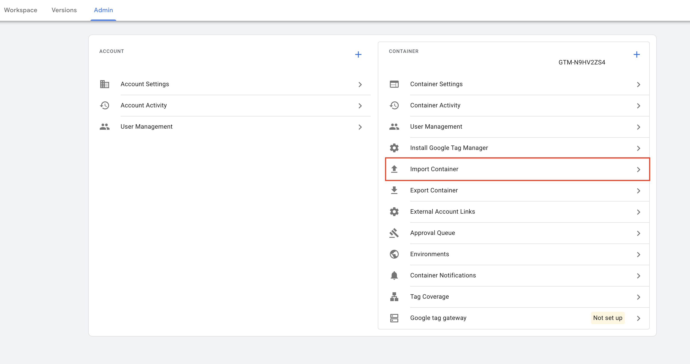

# GTM Dase Templates

Tento repozitár obsahuje predpripravené šablóny (templates) pre Google Tag Manager, ktoré môžete voľne použiť vo svojich projektoch.

## Ako stiahnuť a importovať šablónu

Postupujte podľa nasledujúcich krokov:

### 1. Výber šablóny
Prejdite do priečinka so šablónou, ktorú si prajete stiahnuť.

### 2. Nájdenie JSON súboru
V danom priečinku kliknite na súbor s príponou `.json`, ktorý obsahuje kód šablóny.

### 3. Stiahnutie súboru
Na stránke súboru kliknite vpravo hore na tlačidlo **Raw** alebo na ikonu na stiahnutie. Súbor si uložte do počítača (zvyčajne cez pravý klik a možnosť "Uložiť ako...").

### 4. Import do GTM kontajnera
V rozhraní vášho Google Tag Manager kontajnera prejdite do sekcie **Správca** (Admin). V stĺpci *Kontajner* (Container) zvoľte možnosť **Importovať kontajner** (Import Container).

### 5. Nahratie a zlúčenie
**Dôležité:** Pre správne fungovanie je nutné dokončiť nastavenia podľa inštrukcií. Všetky potrebné informácie o importovaní kontajnera, úprave parametrov a prispôsobení šablóny nájdete v `README.md` súbore v priečinku danej šablóny.

